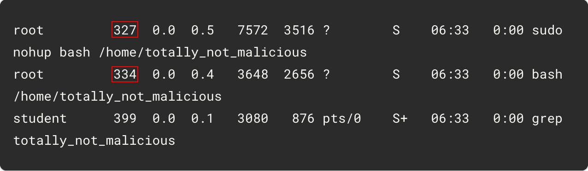

# Maintain Efficient Process Utilization on Linux


# Terminating a specific process

Terminating a specific process
The ps -aux command allows you to list all currently running processes on a Linux machine. However, the list of processes is often super long, which makes finding a specific process pretty tough. To filter the processes you're interested in, you can pipe the output of ps through grep.

There are two "malicious" processes currently running on your machine, called "totally_not_malicious". You can run ps and grep to find them, using this command:

```
ps -aux | grep "totally_not_malicious"
```

You should see output similar to this. The top two lines are the two processes, while the last line is the grep process you just used to search for them. Check out the three-digit numbers on the left of each of the rows; these are the process IDs.




To stop a process, you can use the kill command. You need to use sudo to have permission to stop them. You also need to specify the ID of the process, which will likely be different on your machine than what's shown above (the ID is highlighted in the above output):

```
sudo kill [PROCESS ID]
```
After killing the processes, you can verify that they're no longer running by running the original command again:

```
ps -aux | grep "totally_not_malicious"
```
OUTPUT:

```
student      672  0.0  0.1   3080   876 pts/0    S+   06:36   0:00 grep totally_not_malicious
```


# Terminating multiple processes

There are also multiple processes running on your computer containing the word "razzle". You can find them in the same way that you found the previous process using ps. Because grep doesn't look for full matches, it can be used to find any process that contains a specific substring:

```
ps -aux | grep "razzle"
```

The below shows all six processes that contain the word "razzle". (Again, you can ignore the last process because it's the process running grep.)


```
root         328  0.0  0.6   7572  3616 ?        S    06:33   0:00 sudo nohup bash /home/razzle_dazzle
root         329  0.0  0.5   7572  3480 ?        S    06:33   0:00 sudo nohup bash /home/my_cat_razzle
root         330  0.0  0.5   7572  3520 ?        S    06:33   0:00 sudo nohup bash /home/razzles
root         331  0.0  0.4   3648  2544 ?        S    06:33   0:00 bash /home/my_cat_razzle
root         332  0.0  0.4   3648  2624 ?        S    06:33   0:00 bash /home/razzles
root         333  0.0  0.4   3648  2680 ?        S    06:33   0:00 bash /home/razzle_dazzle
student      773  0.0  0.1   3080   888 pts/0    S+   06:37   0:00 grep razzle
```


To kill each of the processes, you can use the same kill command as before, substituting in each process ID:

```
sudo kill [PROCESS ID]
```

To verify that the processes were successfully stopped, you can use the same command you used to find them in the first place:

```
ps -aux | grep "razzle"
```

You should only see the process for the grep command, indicating that the other processes are no longer running:

```
student      870  0.0  0.1   3080   880 pts/0    S+   06:38   0:00 grep razzle
```

Conclusion
Wohoo! You've successfully used ps to find processes on Linux, and used kill to end them. These are common Linux commands, so we recommend you practice until you feel comfortable using them
